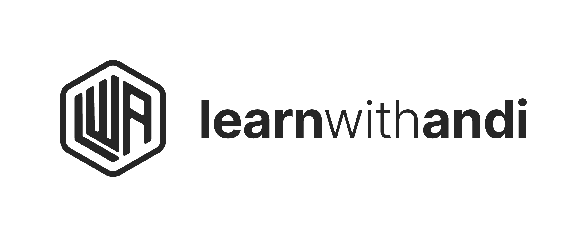

<p align="center">
  
</p>


Official landing page for **Learn With Andi** (LWA), a career accelerator program. 
This project is built with **Next.js 16**, **TypeScript**, and **Framer Motion**, focusing on high-performance, SEO-optimized, and visually engaging user experiences.

<p align="center">
  
  
  
  
</p>

## 🚀 Features

-   **Dynamic Animations**: All sections feature scroll-triggered animations using `framer-motion` for a premium feel (SEO-safe with `viewport={{ once: true }}`).
-   **Generative Engine Optimization (GEO)**: optimized for AI search engines like Google Gemini and ChatGPT via `ai.txt`, `llm.txt`, and `llms.txt`.
-   **Responsive Design**: Fully responsive layout optimized for all device sizes.
-   **Performance**: Optimized images and efficient rendering with Next.js App Router and Server Components.
-   **Custom Design System**: Bespoke styling using CSS Modules and strict color tokens (no Tailwind utility overload).

## 🛠 Tech Stack

-   **Framework**: [Next.js 16](https://nextjs.org/) (App Router)
-   **Language**: [TypeScript](https://www.typescriptlang.org/)
-   **Styling**: CSS Modules
-   **Animation**: [Framer Motion](https://www.framer.com/motion/)
-   **Icons**: [Lucide React](https://lucide.dev/)

## 📂 Project Structure

```bash
src/
├── app/              # Next.js App Router pages and layouts
├── components/       # Reusable UI components (Hero, FAQ, etc.)
├── data/             # Static content and configuration (content.ts)
└── styles/           # Global styles and CSS variables
public/
├── assets/           # Static images and media
├── ai.txt            # AI context for GEO
├── llm.txt           # Concise summary for LLMs
└── llms.txt          # LLM crawler directives
```

## ⚡️ Getting Started

1.  **Clone the repository:**
    ```bash
    git clone https://github.com/alvianzf/learnwithandi.com.git
    cd learnwithandi.com
    ```

2.  **Install dependencies:**
    ```bash
    npm install
    # or
    bun install
    ```

3.  **Run the development server:**
    ```bash
    npm run dev
    # or
    bun dev
    ```

4.  **Open in browser:**
    Navigate to [http://localhost:3000](http://localhost:3000).

## 🔄 Recent Updates

-   **Animation Overhaul**: Implemented `framer-motion` across all 12 landing page sections (`Hero`, `Problem`, `Solution`, `Testimonial`, `CareerWins`, `ProgramGallery`, `Mentors`, `Qualification`, `Offer`, `Faq`, `Cta`, `Footer`).
-   **New Sections**: Added "Career Wins" section to showcase user success stories.
-   **SEO/GEO**: Added and optimized `ai.txt`, `llm.txt`, and `llms.txt` for better visibility in AI-generated summaries.
-   **Bug Fixes**: Resolved CSS preload warnings and server/client component hydration issues.

## 📄 License

&copy; 2026 Learn With Andi. All rights reserved.
